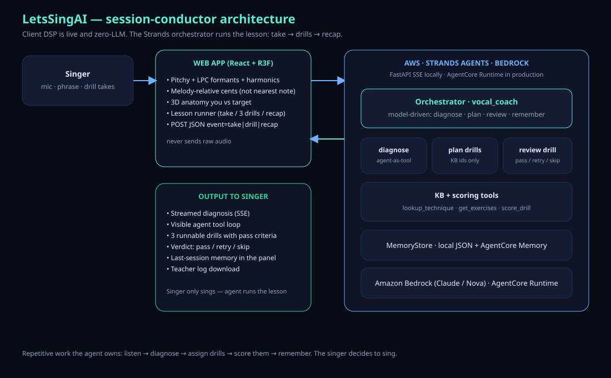

# LetsSingAI

**Agents for Humans · Professional Agents**

You sing a phrase. A [Strands](https://strandsagents.com) agent on Amazon Bedrock runs the rest of the lesson: it listens, names what went wrong, assigns three drills it can actually score, decides pass or retry, and remembers you next time.

Karaoke apps give you a number. Chatbots talk about singing. Neither sits in the room and *does the session*. That’s the unpaid loop a vocal coach repeats every hour — and the work this agent owns.

> The 3D anatomy view is an educational model inferred from your voice (pitch, formants, loudness stability). It is not medical imaging.

**Live demo:** [https://letssingai-production.up.railway.app/](https://letssingai-production.up.railway.app/)  
Chrome, allow the mic. Health: [`/health`](https://letssingai-production.up.railway.app/health) should read `"coach": "bedrock-agent"`.



## Who it’s for

Singers who practice alone, and teachers who want a session log instead of re-diagnosing the same phrase every Tuesday.

This is **skilled practice**, not chores — the Professional Agents track. The singer’s only job is to sing.

## The problem

A human coach spends most of a lesson on the same diagnosis: flat here, no breath there, thin tone, tight throat. Then they pick an exercise, listen again, and try to remember last week.

Apps split that work badly:

- Tuners and karaoke score you against the nearest piano key, so a perfectly centred *wrong note* still looks fine.
- LLM chat wraps a textbook. It never hears the take, never assigns a drill the app can grade, never comes back tomorrow.

Beginners also cannot hear “support” or “placement.” They need to see the instrument, be told what to sing next, and be heard again.

## What the agent actually does

After every take, the **`vocal_coach`** orchestrator (Strands Agents SDK + Amazon Bedrock) runs a model-driven lesson. The browser never sends raw audio — only a compact JSON summary.

1. `recall_singer` — last session, last focus  
2. `diagnose_take` — name the issues and the body parts that moved wrong  
3. `plan_practice` — three knowledge-base drills with pass criteria (not invented homework)  
4. `compare_progress` / `remember_session` — memory (AgentCore Memory when configured, JSON otherwise)  
5. For each drill: `review_drill` — pass, retry, or skip  
6. Recap + a teacher-log download  

The UI shows that tool loop as it happens. If Bedrock is down, the same tools still run on a heuristic path and the badge reads **offline heuristic**. We do not fake a Bedrock session.

**Nova Lite** (`us.amazon.nova-lite-v1:0`) is the path this demo uses: one Strands conductor calling those tools directly. Claude Sonnet can nest specialist agents-as-tools on the same names if you enable it.

## What you see

| Surface | What happens | LLM? |
|---|---|---|
| **Anatomy** | Stylized diaphragm, folds, tract; a target ghost for the correct motion | No — live DSP |
| **Harmonics** | Your H1–H8 against the reference timbre | No |
| **Pitch** | Trail colored by melody error; teal dot is the note you should be on | No |
| **Hear phrase / Demo voice** | Public-domain Twinkle, Ode to Joy, or Amazing Grace | No |
| **Lesson** | Take → 3 scored drills → recap. The agent decides pass/retry | Yes — once per take or drill |

Pitch is scored the way a listener hears it: the centre of a held note against the melody, with room for scoops, vibrato, and landing a bit late. A centred wrong scale degree still misses.

## Architecture

```
Singer  →  React app (mic DSP, 3D, melody score)
                │  compact JSON summary (never raw audio)
                ▼
        FastAPI  POST /coach  (SSE)   event=take|drill|recap
                │
                ▼
        Strands orchestrator  vocal_coach
           ├─ diagnose_take
           ├─ plan_practice
           ├─ review_drill
           ├─ lookup_technique / get_exercises
           └─ recall / remember / compare
                │
                ▼
        Amazon Bedrock (Nova Lite by default; Claude optional)
        AgentCore Runtime  (agent/Dockerfile)
        AgentCore Memory   when AGENTCORE_MEMORY_ID is set
```

`GET /health` → `{ coach: "bedrock-agent"|"heuristic", memory: "agentcore"|"local", model: "…" }`.

## Quick start

### Frontend (works alone)

```bash
cd frontend
npm install
npm run dev        # http://localhost:5173
```

Chrome → pick a phrase → **Hear phrase** → **Start mic** → **Sing a take**. Without the backend, coaching uses the local heuristic. Drills and pass/fail still run.

### Agent (what judges should see)

```bash
cd agent
python -m venv .venv
.venv\Scripts\activate
pip install -r requirements.txt
copy .env.example .env     # then fill AWS keys + BEDROCK_MODEL_ID
python check_bedrock.py    # must print [OK]
python -m uvicorn server:app --port 8000
```

- Default model: `us.amazon.nova-lite-v1:0` (no Anthropic form).  
- `/health` → `"coach": "bedrock-agent"` means the orchestrator is live.  
- Frontend talks to `http://localhost:8000` (`VITE_API_BASE` to override).

Claude Sonnet (`us.anthropic.claude-sonnet-4-20250514-v1:0`) is optional if you want nested specialists.

### AgentCore

```bash
cd agent
docker build -t letssingai-coach .
# CMD is python runtime.py  → BedrockAgentCoreApp
```

The public demo is one HTTPS origin (UI + `/coach` together). See [agent/DEPLOY.md](agent/DEPLOY.md).

### Tests (no AWS)

```bash
cd agent
pytest
```

## Submission

- **Track:** Professional Agents  
- **License:** Apache-2.0  
- **Live demo:** https://letssingai-production.up.railway.app/  
- **Devpost project details (paste-ready):** [DEVPOST_PROJECT_DETAILS.md](DEVPOST_PROJECT_DETAILS.md)  
- **builder.aws.com bonus posts (paste-ready):** [BUILDER_AWS_POSTS.md](BUILDER_AWS_POSTS.md)  
- **Video script, recording checklist:** [SUBMISSION.md](SUBMISSION.md)  
- **Deploy notes:** [agent/DEPLOY.md](agent/DEPLOY.md)

## Tech

React 19 · React Three Fiber · three.js · pitchy · zustand · Vite ·  
**Strands Agents SDK** · Amazon Bedrock (Nova Lite) · FastAPI (SSE) ·  
Bedrock AgentCore Runtime · AgentCore Memory (optional)
